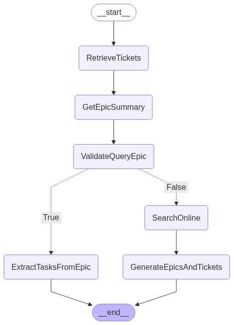

# Certification Challenge – Deliverable Checklist  
**Due August 5, 2025 at 4 PM PT**
# SprintScribe
## Task 1 — Define Problem & Audience  
**Role:** *AI Solutions Engineer*
1. **One-sentence problem statement**  
Tech leads lack a fast, reliable way to turn a statement of work and past Jira knowledge into a repeatable, high-quality implementation plan—especially when unfamiliar technologies are involved.
2. **1–2 paragraphs** explaining why this is a problem for your specific user (describe their job role, pain points, and example questions)
As a Tech lead, you are judged on how quickly you can decompose a statement of work (SOW) into a concrete, step-by-step roadmap that your team and stakeholders trust. Today that means trawling through hundreds of Jira tickets from prior projects, company best practices and copying snippets into spreadsheets, and stitching everything together by hand. Each hour spent hunting for similar user stories, sprint burndowns, or acceptance-criteria patterns is an hour not spent guiding engineers or advising executives.
The pain deepens when a new framework or cloud service appears in the SOW. You must pause the planning exercise, research best practices on the web, then mentally map those findings onto a delivery model you’ve never tried in-house. The result is an uneven plan that may overlook hidden dependencies (“Did we remember security baselines for this unfamiliar PaaS?”) or ignore proven team velocities (“What did it really take our data-platform squad to integrate Snowflake last year?”). Clients feel the uncertainty, and your margin for error—and profit—shrinks.
## Task 2 — Propose Solution  
**Role:** *AI Solutions Engineer*
1. **1–2 paragraphs** describing the user experience and “better world”
In the better world, you paste or upload a task list from the SOW, tag it with a few project attributes (team size, domain, critical dates), and click Generate Plan. Behind the scenes, an engine mines your organization’s Jira history, surfaces analogous tickets, and auto-drafts a phased implementation plan—complete with sprint breakdowns, story point estimates derived from historical velocity, risk registers, and links back to the exact tickets that inspired each section. If the system detects an uncharted technology, it automatically pulls authoritative guidance from trusted web sources, cross-references similar tech you have used, and weaves those insights into the plan so nothing feels experimental or under-researched.
For this iteration, I’ll build an interface that takes a single task from the SOW and automatically produces a detailed set of subtasks with acceptance criteria. It will first mine the company’s Jira history for relevant patterns; if the technology is new to us, the system will enrich the plan by pulling trusted information from the web and by mapping lessons learned from comparable technologies in past projects.
2. **Tool-stack choices** (one sentence each)  
   - LLM - OpenAI GPT-4o-mini for natural language understanding, query processing, and generating implementation plans with structured outputs.
   - Embedding model - OpenAI text-embedding-3-small for converting Jira tickets and queries into vector representations for similarity search.
   - Orchestration layer - LangGraph StateGraph for managing the multi-step agentic workflow with conditional routing between nodes.
   - Vector database - Qdrant in-memory vector store for fast similarity search and retrieval of relevant Jira tickets.
   - Monitoring - LangSmith for interaction monitoring and experiements
   - Evaluation - RAGAS with latency and token consumption using LangSmith.
   - User interface - Next.js React application with TailwindCSS for modern, responsive user experience.
   - *(Optional)* Serving & inference - FastAPI backend for handling agent requests and orchestrating the RAG pipeline.
3. **Agentic reasoning:** where and why you will use agents in the app
The system uses a multi-node LangGraph agent to intelligently route queries through different processing paths based on context. The agent first retrieves similar Jira tickets using ensemble retrieval, then determines if the query relates to an existing epic in the company's history. If related, it extracts all tickets from that epic to provide a historical context. If the query involves unfamiliar technologies, the agent automatically searches online via Tavily to gather authoritative information, then generates new epics and tickets based on both historical patterns and external research. This agentic approach ensures the system can handle both familiar domain knowledge and novel technology requirements without manual intervention.

## Task 3 — Data & APIs  
**Role:** *AI Systems Engineer*

1. **List all data sources and external APIs** with their purpose  
   - **TF-Task.csv**: Historical Jira tickets containing task descriptions, parent keys, summaries, and metadata for similarity matching and pattern extraction.
   - **TF-EPIC.csv**: Jira epic records with issue keys and summaries for contextual grouping and historical project structure analysis.
   - **Tavily Search API**: External web search service for gathering authoritative information about unfamiliar technologies when no relevant historical data exists.

2. **Default chunking strategy** and rationale  
   Each Jira ticket is ingested as an individual document, since tickets are already granular, self-contained, and concise. This approach preserves the natural boundaries of work items, ensures high retrieval precision, and avoids unnecessary fragmentation or loss of context.

3. *(Optional)* Additional data needed for other app components
   For production deployment, additional data sources would include: company coding standards documents, technology decision records (TDRs), past retrospective notes for velocity estimation, and integration with live Jira API for real-time project status updates.
## Task 4 — End-to-End Prototype  
**Role:** *AI Systems Engineer*

- Build and **deploy locally** an **Agentic RAG** prototype using a production-grade stack

## Task 5 — Golden Test Set & Baseline  
**Role:** *AI Evaluation & Performance Engineer*

1. Generate a **synthetic “golden” test set** and evaluate with **RAGAS** (faithfulness, response relevance, context precision, context recall)  
2. Provide a **results table** and brief conclusions on baseline performance

## Task 6 — Advanced Retrieval Upgrade  
**Role:** *AI Systems Engineer*

1. **List advanced retrieval techniques** you'll test (one-sentence justification each)  
   - **Multi-Query Retrieval**: Automatically generates multiple query variations to capture different phrasings of the same intent, improving recall for tickets that might use different terminology than the original SOW.
   - **Ensemble Retrieval**: Combines naive vector similarity search with multi-query retrieval using equal weighting to balance precision and recall, reducing the risk of missing relevant historical patterns.

2. Implement and test them in your application
✅ **Implemented in the code attached to this project**

## Task 7 — Performance Comparison  
**Role:** *AI Evaluation & Performance Engineer*

1. Re-evaluate improved system vs. original with **RAGAS**; present a **comparison table**  
2. Summarize insights and planned next steps for the second half of the course.
- Use similar topics to permate companies good practices when creating Jira tasks usign the internet.
- Use agent reasoning to refine the tickets based on the engagement caracteristics.
- Use containers, user quadrant web to preload the content.

## Final Submission Package  

Submit a public (or shared) **GitHub repository** containing:  

1. A **≤ 5-minute Loom video** demonstrating the app and describing the use case  
2. A **written document** answering every deliverable above  
3. **All source code**

> **Tip:** Use this checklist to track progress and ensure every deliverable is ready by the deadline. Good luck!

I am a consultant and I need to create an implementation plan for a project following the companies best practices and prior projects.

